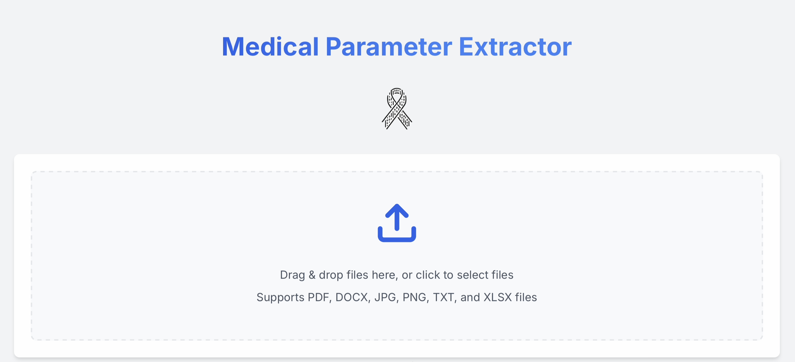

# OnkoMiner

Tento projekt byl vytvořen v rámci [Rakathonu](https://www.rakathon.cz) v Praze 11.4.-13.4 2025.
Toto je finální release verze po Hackathonu.

**Team Modprobe p53**

## O projektu



OnkoMiner je nástroj pro extrakci medicínských parametrů z lékařských dokumentů. Aplikace analyzuje texty (převážně v češtině) a automaticky identifikuje důležité onkologické parametry za pomoci umělé inteligence.

## Funkce

- Podporuje různé formáty souborů (PDF, DOCX, TXT, XLSX)
- Anonmizace citlivých údajů
- Použití velkého jazykového modelu (LLM) - lokálně nebo externě dle nastavení
- Dva módy extrakce:
  - **Standard** - extrahuje 40 hlavních parametrů
  - **Extended** - extrahuje 250 parametrů definovaných podle připravovaného standradu **ÚZIS** a **ČOS**
- Rozdělení parametrů dle kategorií
- Možnost úprav vygenerovaných parametrů
- Exportuje výsledky v CSV formátu
- Uživatelsky přívětivé rozhraní

## Instalace

Stáhněte .exe v release. 

```
docker-compose up -d
```

Aplikace bude dostupná v prohlížeči na adrese http://localhost:3000

